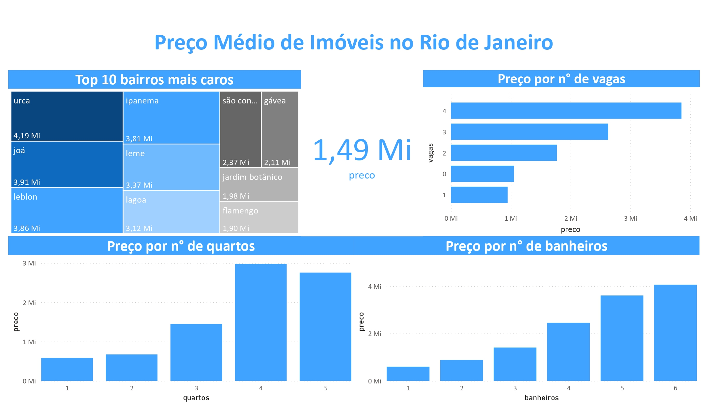

# Web Scraping - Imóveis Rio de Janeiro
## Introdução
Este é um projeto de estudo que consiste em realizar uma "raspagem" de dados na web sobre imóveis na cidade do Rio de Janeiro e modelar um relatório simples com o Microsoft Power BI para análise das informações coletadas.

Os dados foram retirados do site de imóveis Zap Imóveis, são dados referentes ao endereço, ao número de quartos, número de banheiros, número de vagas, tamanho do imóvel em m², valor da taxa de condomínio(caso exista) e o preço de casas e apartamentos de diferentes locais da cidade. 

Os scripts foram escritos em Python. Utilizando as bibliotecas Requests, Selenium e BeautifulSoup para a coleta e as bibliotecas Pandas e Numpy para a limpeza e organização dos dados em um formato tabular.

## Coleta e Limpeza
Utilizei o Selenium para navegar entre as paginás 1, 2, 3 e assim por diante até o limite máximo do site, e a cada troca de página utilizei o BeautifulSoup para coletar o html e recolher as informações dispóniveis. Cada informação - n° de quartos, tamanho, etc - foi adicionada a uma lista que mais tarde se tornou uma coluna da tabela. Logo em seguida exportamos a tabela em formato csv para um diretório local.

O processo de limpeza consiste em carregar o arquivo csv gerado pelo script de coleta e aplicar os seguintes passos:

1. Remover valores duplicados
2. Alterar os valores nulos do condomínio para 0.
3. Remover colunas com valores inválidos.
4. Corrigir erros de digitação e coleta.
5. Extração dos bairros do endereço(Engenharia de variáveis).
6. Conferencia se os bairros foram extraídos corretamente, e para isso, foi utilizado um scraping simples do Wikipedia para coletar o nome de todos os bairros do Rio de Janeiro e em seguida a comparação com os bairros extraidos de endereço.
7. Alteração do tipo das variáveis.
8. Remoção de alguns outliers extravagantes

Após a limpeza os dados foram novamente exportados em csv.

## Análise
O objetivo da análise foi responder algumas perguntas simples a respeito da variação do preço.

- Quais são os 10 bairros mais caros da cidade?
- Como o preço varia em relação ao número de quartos, banheiros e vagas?
- Qual o valor médio dos imóveis na cidade?

Logo abaixo pode ser visualizado o relatório do Microsoft Power BI gerado.

  

## Limitações e Riscos
1. Apesar de o site possuir cerca de 330 mil registros, nos conseguimos coletar apenas 10000, pois há um limite de páginas a ser exibido em uma busca ampla.
2. Como os dados foram retirados apenas de um site é provável que os dados estejam enviesados pela seleção.

## Próximos Passos
1. Coletar dados de outros sites de imóveis.
2. Estimar se os padrões observados são estatísticamente significativos.
3. Usar os dados para treinar um modelo de Machine Learning.
